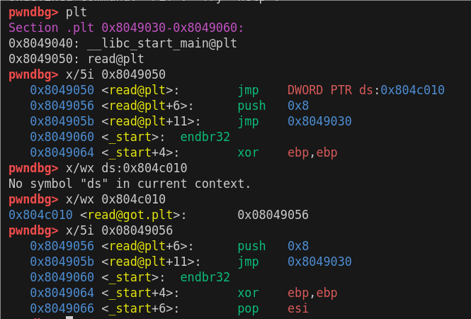

# ret2dlresolve

最近遇见了很多和linkmap相关的内容，之前一直觉得这种题目要么太简单可以用pwntools直接一把梭掉，要么太难没必要看，但是最近觉得还是要好好学习一下

参考文章：[ret2dl_resolve - 狒猩橙 - 博客园 (cnblogs.com)](https://www.cnblogs.com/pwnfeifei/p/15701859.html)

## i386

demo：

```c
// gcc -m32 -fno-stack-protector -no-pie -z relro -g -o demo demo.c
#include <stdio.h>
int main(){
    int data[20];
    read(stdin, data, 20);
    return 0;
}
```



发现第一次加载时的调用链 `read@plt --> read@got --> read@plt+6`

最终会调用 `_dl_runtime_resolve` 中的 `_dl_fixup` 函数

### 相关数据结构

```bash
c10uds@c10uds-virtual-machine:~/Desktop/tmp$ readelf -d demo

Dynamic section at offset 0x2f10 contains 24 entries:
  Tag        Type                         Name/Value
 0x00000001 (NEEDED)                     Shared library: [libc.so.6]
 0x0000000c (INIT)                       0x8049000
 0x0000000d (FINI)                       0x80491c4
 0x00000019 (INIT_ARRAY)                 0x804bf08
 0x0000001b (INIT_ARRAYSZ)               4 (bytes)
 0x0000001a (FINI_ARRAY)                 0x804bf0c
 0x0000001c (FINI_ARRAYSZ)               4 (bytes)
 0x6ffffef5 (GNU_HASH)                   0x80481ec
 0x00000005 (STRTAB)                     0x804826c
 0x00000006 (SYMTAB)                     0x804820c
 0x0000000a (STRSZ)                      91 (bytes)
 0x0000000b (SYMENT)                     16 (bytes)
 0x00000015 (DEBUG)                      0x0
 0x00000003 (PLTGOT)                     0x804c000
 0x00000002 (PLTRELSZ)                   16 (bytes)
 0x00000014 (PLTREL)                     REL
 0x00000017 (JMPREL)                     0x8048314
 0x00000011 (REL)                        0x8048304
 0x00000012 (RELSZ)                      16 (bytes)
 0x00000013 (RELENT)                     8 (bytes)
 0x6ffffffe (VERNEED)                    0x80482d4
 0x6fffffff (VERNEEDNUM)                 1
 0x6ffffff0 (VERSYM)                     0x80482c8
 0x00000000 (NULL)                       0x0
```

这里的每一个表项是用一个 `Elf32_Dyn` 结构体描述的，这个结构体的定义如下

```c
1 typedef struct {
2     Elf32_Sword     d_tag;
3     union {
4         Elf32_Word  d_val;
5         Elf32_Addr  d_ptr;
6     } d_un;
7 } Elf32_Dyn;
8 extern Elf32_Dyn_DYNAMIC[];
```

对于不同的类型,  `d_val/d_ptr` 有不同的含义，具体如下表


因此 我们可以从dynamic的信息获得 `.rel.plt & .dynsym & .dynstr` 的地址 

### .rep.plt

这个表中存放了重定向的有关信息，相关结构体定义如下

```c
typedef struct {
	Elf32_Addr        r_offset;
    Elf32_Word       r_info;
} Elf32_Rel;
```

`r_offset` 表示的是got表的地址，r_info的作用有两个：1. `r_info >> 8` 表示该函数对应在符号表.dynsym中的下标，`r_info&0xff `则表示重定位的类型。

```bash
c10uds@c10uds-virtual-machine:~/Desktop/tmp$ readelf -r demo

Relocation section '.rel.dyn' at offset 0x304 contains 2 entries:
 Offset     Info    Type            Sym.Value  Sym. Name
0804bff8  00000306 R_386_GLOB_DAT    00000000   __gmon_start__
0804bffc  00000406 R_386_GLOB_DAT    00000000   stdin@GLIBC_2.0

Relocation section '.rel.plt' at offset 0x314 contains 2 entries:
 Offset     Info    Type            Sym.Value  Sym. Name
0804c00c  00000107 R_386_JUMP_SLOT   00000000   __libc_start_main@GLIBC_2.34
0804c010  00000207 R_386_JUMP_SLOT   00000000   read@GLIBC_2.0
```

如上表，0x804c010为 r_offset ，在read被动态解析之后，会在这个地址填入真实地址，对于r_info, 计算可得 (r_info >> 8) == 2, 也就是说read